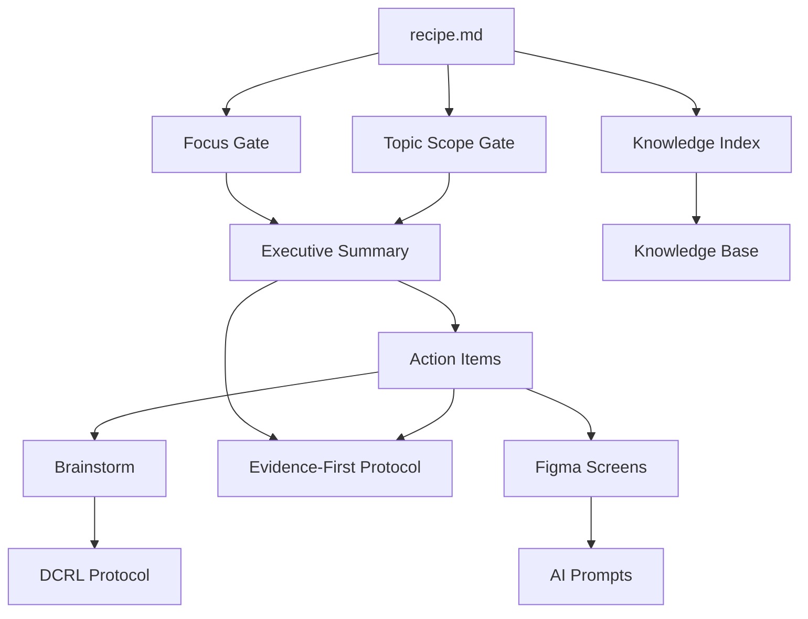

# Signal-to-Action System Architecture

Comprehensive guide to system organization, component relationships, and extension points.

## System Overview

The Signal-to-Action system transforms unstructured inputs through a pipeline of natural language processing instructions, producing evidence-backed artifacts for decision-making and action.

### Design Philosophy

1. **Natural Language First**: All instructions readable by humans and LLMs
2. **Composable Components**: Mix protocols, templates, and gates  
3. **Evidence-Backed**: Every output traces to source material
4. **Extensible**: Easy to add variants and new workflows
5. **Data Separation**: System logic distinct from user data

## Directory Structure

### System Components (`/projects/systems/signal-to-action/`)

```
signal-to-action/
├── core/                          # Core recipes and flows
│   ├── recipe.md                 # Main recipe (source of truth)
│   ├── meta-recipe.md           # How recipes work conceptually
│   ├── recipe-summary.md        # TLDR version
│   └── overview-of-recipe.md    # Detailed workflow explanation
│
├── components/                    # Modular building blocks
│   ├── protocols/               # Processing protocols
│   │   ├── evidence-first.md   # Citation and anti-drift
│   │   ├── dcrl.md            # Dual-Channel Recursion Lock
│   │   └── ...                # Future protocols
│   │
│   ├── templates/              # Artifact templates
│   │   ├── executive-summary.md
│   │   ├── action-items.md
│   │   ├── brainstorm.md
│   │   └── ...                # Future templates
│   │
│   ├── gates/                  # Decision points
│   │   ├── focus-gate.md      # Domain classification
│   │   ├── topic-scope-gate.md # Topic prioritization  
│   │   └── ...                # Future gates
│   │
│   └── extensions/             # Optional components
│       ├── figma-screens.md   # Design inventory
│       ├── ai-prompts.md      # AI tool prompts
│       └── ...                # Future extensions
│
├── commands/                      # Slash command definitions
│   ├── run-recipe.md            # Main command
│   └── index.md                # Command registry
│
├── knowledge/                     # Knowledge integration
│   └── index.md                # Maps to /capturebox/knowledge/
│
└── reference/                     # Specifications
    ├── frontmatter-spec.md     # Frontmatter definitions
    ├── naming-conventions.md   # File naming rules
    ├── linkage-protocol.md     # TS-n to AI-n linking
    └── examples/               # Reference examples
```

### Data Organization (`/capturebox/data/signal-to-action/`)

```
data/signal-to-action/
├── raw-inputs/                   # Unprocessed sources
│   ├── transcripts/            # Meeting recordings
│   ├── jira-exports/          # Story/epic exports  
│   ├── specs/                 # Technical specifications
│   └── braindumps/            # Informal notes
│
├── processed-outputs/            # Generated artifacts
│   ├── executive-summaries/   # [TS-n] tagged summaries
│   ├── action-items/          # [AI-n] tagged items
│   ├── brainstorms/           # DCRL-driven ideation
│   └── design-artifacts/      # Figma, prompts, etc.
│
├── config/                       # Configuration
│   ├── workspace-config.yaml  # Active workspace settings
│   └── lens-packs/            # Knowledge subsets
│
├── archive/                      # Historical data
│   └── YYYY/                  # Year-based organization
│       └── MM/                # Month subdirectories
│
└── workspace/                    # Active work
    ├── active/                # Currently processing
    └── staging/               # Ready for processing
```

## Component Relationships

### Dependency Graph



### Data Flow

```
1. Input Stage
   raw-inputs/ → Focus Gate → Topic Scope Gate

2. Processing Stage  
   → Executive Summary (with [TS-n] tags)
   → Action Items (with [AI-n] tags, linked to [TS-n])
   → Brainstorm (seeded from Action Items)

3. Extension Stage (optional)
   → Figma Screens (for ux-xdr focus)
   → AI Design Prompts (from screens)
   → Worksheets (problem/solution analysis)

4. Output Stage
   → processed-outputs/ (organized by type)
   → workspace/active/ (if ongoing)
   → archive/YYYY/MM/ (when complete)
```

## Frontmatter Schema

All system components use structured frontmatter:

### System Component Frontmatter
```yaml
---
type: system-component
component: core|protocol|template|gate|extension|command
name: <descriptive name>
version: <semver>
dependencies: [<component list>]
related: [<related components>]
parent: <parent system or component>
created: YYYY-MM-DD
updated: YYYY-MM-DD  
maintainer: <team/person>
description: <one-line description>
---
```

### Data Artifact Frontmatter

Each artifact type has specific requirements:

#### Executive Summary
```yaml
---
type: executive-summary
topic: <human readable>
source: <filename>
created: <source date>
scope: meeting|story|spec
audience: me|team|leadership
polish: scratch|team-ready|leadership-ready
version: <number>
---
```

#### Action Items
```yaml
---
type: action-items
topic: <human readable>
source: <filename>
created: <source date>
scope: meeting|story|spec
rollup_of: [<dates>]  # optional
version: <number>
---
```

## Extension Mechanisms

### Adding Recipe Variants

1. Create variant file in `core/recipes/`:
```yaml
---
type: system-component
component: core
parent: recipe.md
variant-of: main-recipe
variant-type: specialized|simplified|extended
use-case: <specific scenario>
---
```

2. Override specific sections while inheriting others
3. Register in command system if needed

### Adding New Protocols

1. Create in `components/protocols/`
2. Define clear interfaces:
   - Input requirements
   - Processing rules
   - Output format
   - Integration points

3. Update recipes to reference new protocol

### Adding New Gates

Gates must be:
- Fast (< 2 minutes to complete)
- Decisive (clear yes/no/modify outcomes)
- Non-blocking (can always make a decision)

### Adding New Templates  

Templates must include:
- Required frontmatter fields
- Clear section structure
- Integration points (inputs/outputs)
- Examples of usage

## Quality Controls

### Evidence-First Protocol
- Every claim cites source: `[file:L1-L2 — Speaker]`
- Distinguish quotes from inferences
- Include temporal markers
- Flag unverifiable statements

### Linkage Protocol
- Executive Summary tags: `[TS-n]`
- Action Items reference: `[AI-n]` + `[TS-n]`
- No orphaned action items
- No circular dependencies

### Gate Controls
- Focus Gate: 60-120 second decision
- Topic Scope Gate: One primary topic
- Parking Lot: Explicit deferrals

## Performance Optimization

### Lens Packs
Load only needed knowledge:
- **UX-XDR Lens**: Personas, UX principles, creative tools
- **Security-Tech Lens**: Schemas, atomic actions, catalogs
- **Minimal Lens**: Core definitions only
- **Full Context**: Everything (slow but comprehensive)

### Parallel Processing
When possible, process in parallel:
- Multiple transcripts → Multiple summaries
- Different topics → Separate pipelines
- Independent gates → Concurrent execution

### Caching Strategy
- Knowledge files: Load once per session
- Templates: Keep in memory
- Previous outputs: Reference, don't reload

## Maintenance Guidelines

### Version Management
- Increment component versions on changes
- Maintain backward compatibility
- Document breaking changes
- Tag stable releases

### Testing Approach
- Each component testable independently
- Use example inputs/outputs
- Verify citation accuracy
- Check gate decision logic

### Documentation Standards
- Every component self-documents
- Include examples in each file
- Cross-reference related components
- Maintain this STRUCTURE.md

## Common Patterns

### Multi-Session Rollup
```yaml
# In action-items frontmatter:
rollup_of: [2025-11-20, 2025-11-18, 2025-11-15]
```

### Topic Branching
```markdown
Primary topic: Authentication flow redesign
Parking Lot:
  - Performance optimization — needs profiling data
  - Team structure changes — pending reorg
Note: Creating separate summary for "API versioning strategy"
```

### Evidence Chaining
```
Executive Summary: "Decision to use OAuth2" [TS-3]
Action Items: "Implement OAuth2 flow [AI-1]... Evidence: [TS-3]"
Brainstorm: "Riff on [AI-1]: OAuth2 with biometric option"
```

## Troubleshooting

### Component Not Found
- Check dependency declarations
- Verify file paths in frontmatter
- Ensure proper component type

### Citation Mismatches
- Verify source file line numbers
- Check speaker name consistency
- Ensure timestamp accuracy

### Gate Conflicts
- Focus Gate overrides Topic Scope
- High relevance overrides low focus
- Document gate decision rationale

## Future Roadmap

### Planned Enhancements
- [ ] Automated gate decisions via ML
- [ ] Real-time collaborative editing
- [ ] Integration with project management tools
- [ ] Custom protocol builder
- [ ] Analytics dashboard

### Extension Points
- Custom gates for specialized domains
- Industry-specific templates
- Alternative brainstorming protocols
- Automated quality scoring

## References

- Main Recipe: `core/recipe.md`
- Protocol Specifications: `components/protocols/`
- Template Library: `components/templates/`
- Knowledge Index: `knowledge/index.md`
